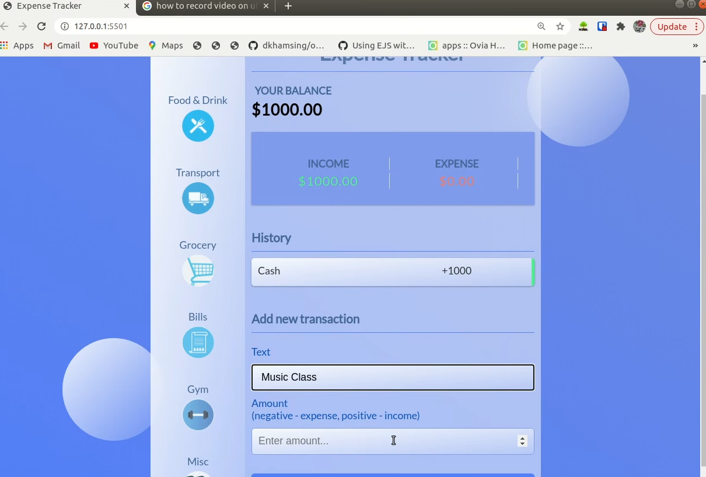

## Budget App
An expense calculator built with vanilla JS, HTML and CSS.Main with a focus on building a user friendly UI/UX.

## Motivation
The motivation behind this application is to learn the functionality of a budgeting app, while getting familiar with the tech stack used.

## Tech

- VanillaJS
- DOM Manipulation
- HTML
- CSS

## Screenshots

 © [zyphuscode]()